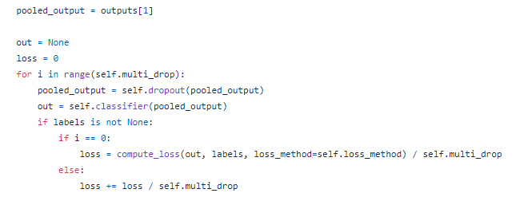
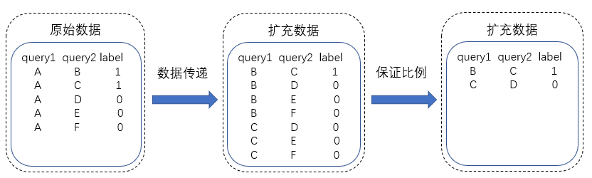
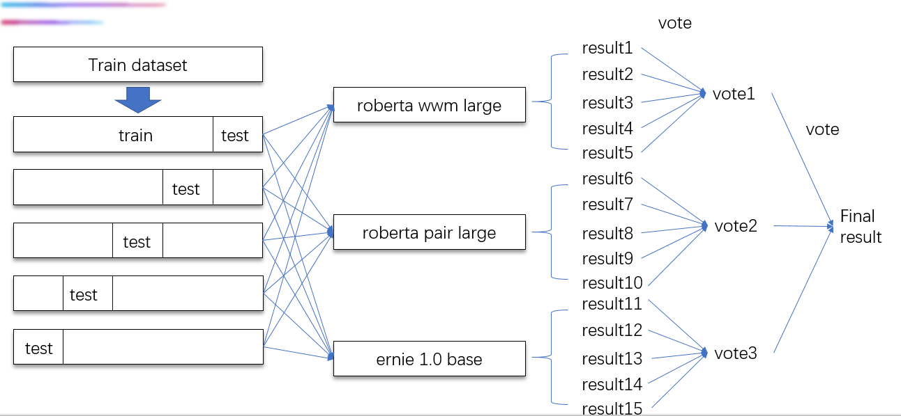

# nCoV-2019  sentence similarity
### 比赛地址

https://tianchi.aliyun.com/competition/entrance/231776/introduction

### 竞赛题目

比赛主打疫情相关的呼吸领域的真实数据积累，数据粒度更加细化，判定难度相比多科室文本相似度匹配更高，同时问答数据也更具时效性。本着宁缺毋滥的原则，问题的场地限制在20字以内，形成相对规范的句对。要求选手通过自然语义算法和医学知识识别相似问答和无关的问题。

### 竞赛数据

本次大赛数据包括：脱敏之后的医疗问题数据对和标注数据。医疗问题涉及“肺炎”、“支原体肺炎”、“支气管炎”、“上呼吸道感染”、“肺结核”、“哮喘”、“胸膜炎”、“肺气肿”、“感冒”、“咳血”等10个病种。

数据共包含train.csv、dev.csv、test.csv三个文件，其中给参赛选手的文件包含训练集train.csv和验证集dev.csv，测试集test.csv 对参赛选手不可见。

每一条数据由Id, Category，Query1，Query2，Label构成，分别表示问题编号、类别、问句1、问句2、标签。Label表示问句之间的语义是否相同，若相同，标为1，若不相同，标为0。其中，训练集、验证集Label已知，测试集Label未知。

示例
编号：0
类别：肺炎
问句1：肺部发炎是什么原因引起的？
问句2：肺部发炎是什么引起的
标签:1

编号：1
类别：肺炎
问句1：肺部发炎是什么原因引起的？
问句2：肺部炎症有什么症状
标签:0

### 提交说明

提交说明

参赛者提交的模型在运行后针对测试数据需生成**result.csv** 文件。

格式如下：

id,label
0,1
1,0
2,1

具体格式请见test示例。

### 评估指标

选手检验出的结果和标准答案对比。

本次比赛测评指标为准确率，计算公式为：

准确率 = 正确预测数目 / 总问题对数目

##  解决方案

### 预训练模型

**`RoBERTa-large-pair`**   大句子对模型

参数量 290M

存储大小 1.20G

语料 **CLUECorpus2020**

下载地址：https://github.com/CLUEbenchmark/CLUEPretrainedModels

### 训练数据

 - train.csv   原始训练数据

 - train_dev.csv   原始训练数据+验证数据

 - train_dev_improve.csv 数据增强数据

   

   **增强方法（举例）：**

   增强前：

   | id   | category | query1                   | query2                         | label |
   | ---- | -------- | ------------------------ | ------------------------------ | ----- |
   | 0    | 咳血     | 剧烈运动后咯血,是怎么了? | 剧烈运动后咯血是什么原因？     | 1     |
   | 1    | 咳血     | 剧烈运动后咯血,是怎么了? | 剧烈运动后为什么会咯血？       | 1     |
   | 2    | 咳血     | 剧烈运动后咯血,是怎么了? | 剧烈运动后咯血，应该怎么处理？ | 0     |
   | 3    | 咳血     | 剧烈运动后咯血,是怎么了? | 剧烈运动后咯血，需要就医吗？   | 0     |
   | 4    | 咳血     | 剧烈运动后咯血,是怎么了? | 剧烈运动后咯血，是否很严重？   | 0     |

   增强后：

   | id    | category | query1                     | query2                         | label |
   | ----- | -------- | -------------------------- | ------------------------------ | ----- |
   | 10749 | 咳血     | 剧烈运动后咯血是什么原因？ | 剧烈运动后为什么会咯血？       | 1     |
   | 10750 | 咳血     | 剧烈运动后咯血是什么原因？ | 剧烈运动后咯血，应该怎么处理？ | 0     |
   | 10751 | 咳血     | 剧烈运动后咯血是什么原因？ | 剧烈运动后咯血，需要就医吗？   | 0     |
   | 10752 | 咳血     | 剧烈运动后咯血是什么原因？ | 剧烈运动后咯血，是否很严重？   | 0     |
   | 10753 | 咳血     | 剧烈运动后为什么会咯血？   | 剧烈运动后咯血，应该怎么处理？ | 0     |
   | 10754 | 咳血     | 剧烈运动后为什么会咯血？   | 剧烈运动后咯血，需要就医吗？   | 0     |
   | 10755 | 咳血     | 剧烈运动后为什么会咯血？   | 剧烈运动后咯血，是否很严重？   | 0     |

### 模型训练 (5 fold, 5epochs)

 - model_0    由train.csv 数据训练

 - model_1     由train_dev.csv+train_dev_improve.csv 数据训练

 - model_2     由train_dev.csv数据训练

   

### 模型得分
| model_0 | model_1 | model_2 | 得分   |
| ------- | ------- | ------- | ------ |
| 1       | 0       | 0       | 0.9545 |
| 0       | 1       | 0       | 0.9583 |
| 0       | 0       | 1       | 0.9585 |
| 0.2     | 0.4     | 0.4     | 0.9609 |
| 0.1     | 0.6     | 0.3     | 0.9616 |
| 0.1     | 0.5     | 0.4     | 0.9625 |
| 0.1     | 0.4     | 0.5     | 0.961  |

**选择最高得分的权重进行预测**

### 依赖环境

- tensorflow:latest-cuda10.0-py3
- python==3.6

- keras_bert==0.81.0
- pandas
- numpy
- sklearn
- tqdm

### 代码复现

运行main.sh即可# nCoV-2019-sentence-similarity

## 前排大佬解决方案

**[Rank1:](<https://tianchi.aliyun.com/mas-notebook/preview/88952/cd6347a0-78b9-11ea-9dd8-017940852515.ipynb/-1?lang=> )**

- 模型融合

小模型同时加入CHIP2019数据训练

| **模型**           | **特点**                   | **权重** | **加入外部句对数据** |
| ------------------ | -------------------------- | -------- | -------------------- |
| BERT-wwm-ext       | 全词Mask                   | 1        | YES                  |
| Ernie-1.0          | 对词、实体及实体关系建模   | 1        | YES                  |
| RoBERTa-large-pair | 面向相似性或句子对任务优化 | 1        | NO                   |

 

- 预测时：算数平均→几何平均→sigmoid平均（用反函数取出sigmoid/softmax归一化之前的状态做平均，信息量更大，提升明显）

 

- 分类阈值微调（0.47）
- 伪标签

 

[**Rank2:**](<https://tianchi.aliyun.com/mas-notebook/preview/89166/94fc37b0-7985-11ea-a388-bb4fdbd693b8.ipynb/-1?lang=> )

- 数据增强：

- - 外部数据增强：首先使用比赛中的原始数据构建筛选模型（采用roberta_large_pair模型)，后对chip2019的数据进行预测。筛选预测的概率处于(0.20~0.80)之间的数据作为外部增强数据
  - 内部数据增强：传递性（保持数据平衡）、训练集8个类别，测试集10个类别，通过病名/药名的替换生成**缺失类别**的数据。

 

- 预训练模型选择：

- - ERNIE

在医疗数据中，往往会存在较多的实体概念；此外文本相似度作为问答任务的子任务，数据描述类型也偏向于口语。ERNIE是百度提出的知识增强的语义表示模型，通过对词、实体等语义单元的掩码，使模型学习完整概念的语义表示，其训练语料包括了百科类文章、新闻资讯、论坛对话。因此ERNIE能够更准确表达语句中实体的语义，且符合口语的情景。

- Roberta_large

Roberta_large是目前大多数NLP任务的SOTA模型。在Roberta_large中文版本使用了动态掩码、全词掩码，增加了训练数据，并改变了生成的方式和语言模型的任务。因此，在医疗文本上，Roberta_large能更好地对文本进行编码。

- Roberta_large_pair

Roberta_large_pair是针对文本对任务提出的专门模型，能够较好地处理语义相似度或句子对问题。因此，在医疗文本相似度任务上，往往能够取得更好的结果。

- 模型训练

- - Multi-sample-dropout

在训练过程中，由于Bert后接了dropout层。为了加快模型的训练，我们使用multi-sample-dropout技术。通过对Bert后的dropout层进行多次sample，并对其多次输出的loss进行平均，增加了dropout层的稳定性，同时使得Bert后面的全连接层相较于前面的Bert_base部分能够得到更多的训练。

 

- 数据交叉

通过数据交叉，即训练时使用不同的数据进行组合，能够在**数据层面**增加模型簇的多样性。这次比赛中，我们秉承的insight是：将难的数据集（外部数据）给更强大的模型，使小的模型能够精准预测，大的模型更具鲁棒性。 此外，也可以通过KL散度计算不同组合的模型的差异，并计算模型两两间的差异和，计算模型簇整体的多样性；以这样的形式，选取数据组合。

| **模型**           | **原始数据** | **增强数据（外部数据）** | **增强数据（传递性）** | **增强数据（新类别）** |
| ------------------ | ------------ | ------------------------ | ---------------------- | ---------------------- |
| ERNIE              | yes          | no                       | yes                    | yes                    |
| Roberta_large_pair | yes          | yes                      | yes                    | yes                    |
| Roberta_large      | yes          | yes                      | yes                    | no                     |

 

- 测试数据增强

在医疗文本相似度任务中，交换两个文本的数据不会改变该文本对的标签。但是对于Bert来说，**交换文本对的位置，会改变位置编码，能使模型从不同的角度取观察这两个文本的相似性**。在测试数据增强时，通过计算原始文本对与交换文本对的输出概率的平均值，能够使模型更好地在测试数据上的进行预测。

 

[**Rank3:**](<https://tianchi.aliyun.com/mas-notebook/preview/88953/52f1cd10-78ba-11ea-9dd8-017940852515.ipynb/-1?lang=> )

1. 通过相似性传递增强数据

 

1. 采用对抗训练

| **query 1**            | **query 2**                  | **label(true)** | **label(fgm)** | **label(none)** |
| ---------------------- | ---------------------------- | --------------- | -------------- | --------------- |
| 腰和后背疼是胸膜炎吗？ | 腰和后背疼是胸膜炎的症状吗？ | 0               | 0              | 1               |
| 右下肺部感染是肺炎吗?  | 又下肺部感染是肺炎不是       | 1               | 1              | 0               |
| 23价肺炎有必要打吗     | 23价肺炎有什么作用           | 0               | 0              | 1               |

 

1. 组间投票再投票的融合方式

 

[**Rank4:**](<https://tianchi.aliyun.com/mas-notebook/preview/88964/04dcb040-78bf-11ea-9dd8-017940852515.ipynb/-1?lang=> )

RoBERTa-large，将最后一层的进行平均池化操作并与[cls]进行拼接。在训练时采用对抗训练（PGD）增强语义信息。

 

  def forward(self, input_ids, input_masks, segment_ids):

​    sequence_output, pooler_output, hidden_states = self.bert_model(input_ids=input_ids, token_type_ids=segment_ids,attention_mask=input_masks)

​    seq_avg = torch.mean(sequence_output, dim=1)

​    concat_out = torch.cat((seq_avg, pooler_output), dim=1)

​    logit = self.classifier(concat_out)

​    return logit

 

